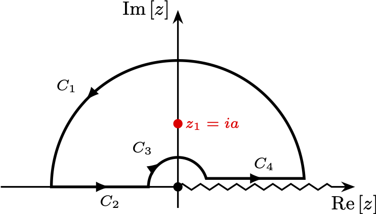
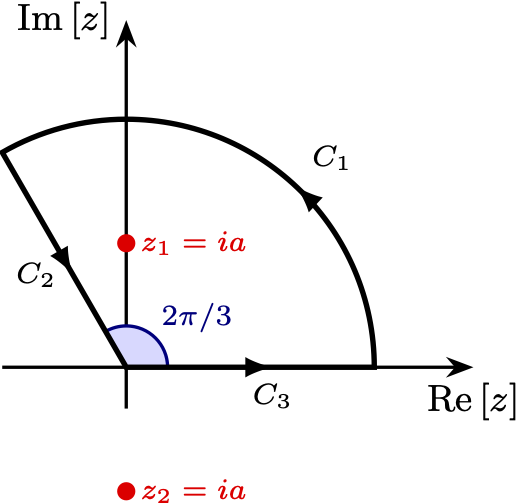
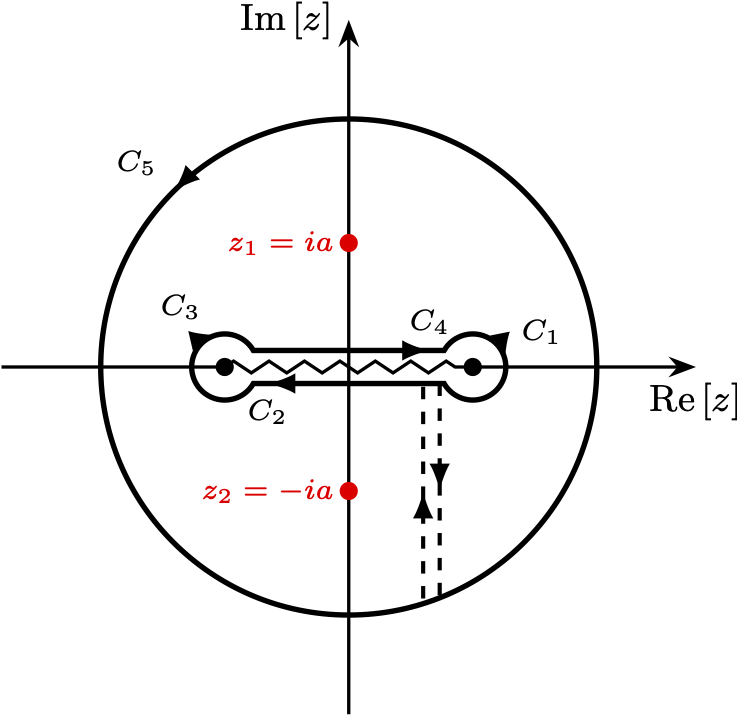

# Contour Integration Paths
tikz figures of complex contour integration paths that I made for a math class.

# Compilation
To compile the document together, a `makefile` is included. In the terminal simply execute,
```bash
make
```
Figures can also be outputted to an eps image to be included in separate documents or for distribution. This is accomoplished with the externalization tikz library, and a separate tex file `main_eps.tex` is included with the following in the document preamble,
```tex
\usetikzlibrary{external}
\tikzset{external/system call={latex \tikzexternalcheckshellescape -halt-on-error
-interaction=batchmode -jobname "\image" "\texsource";
dvips -o "\image".ps "\image".dvi;
ps2eps "\image.ps"}}
\tikzexternalize
```
In the document, uncomment the figure you would like to compile. The makefile also has an option to compile this document using a shell escape with `latex --shell-escape` rather than `pdflatex` used by the `latexmk` command. This option is selected in the make file by executing in the terminal,
```bash
make eps
```
To clean all production files,
```bash
make clean
```
# Examples





# Modifying tikz files
I used a grid in each tikz figure to aid in placing the annotations. Before compiling to eps for distribution it is recommended that the line containing,
```tex
\draw[step=0.5cm,gray,dotted,thin] (-3.9,-3.9) grid (3.9,3.9);
```
is commented out.

The size of the figure can be easily modified by changing the scale at the top of each tikz figures.
```tex
\begin{tikzpicture}[scale=0.7]
  ...
\end{tikzpicture}
```
Note that the axis labels and annotations font size will not change with the scale. Axis labels are currently set to `\small`, annotations are set to `\scriptsize`. Adjust as needed.
